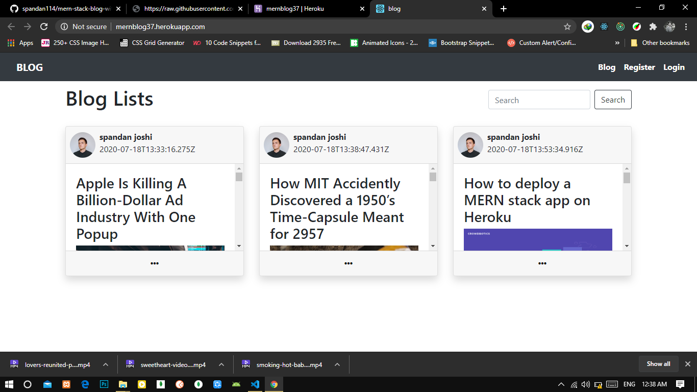
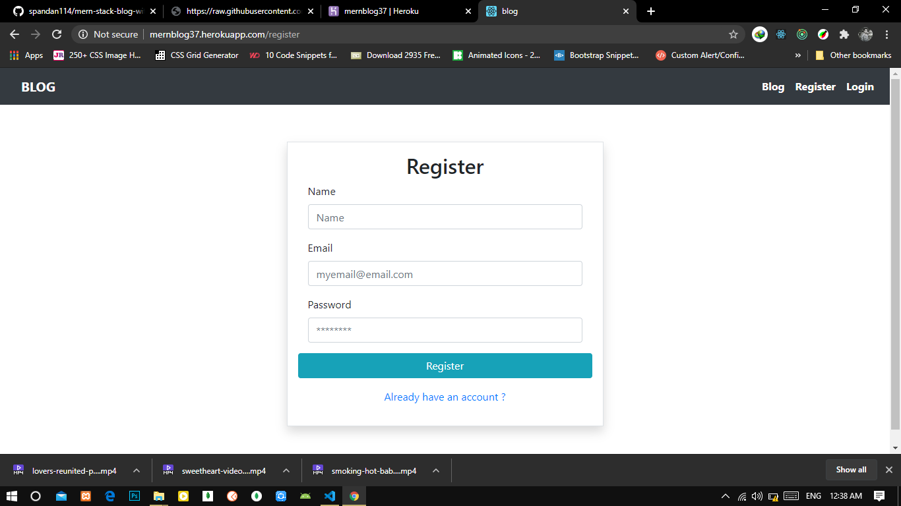
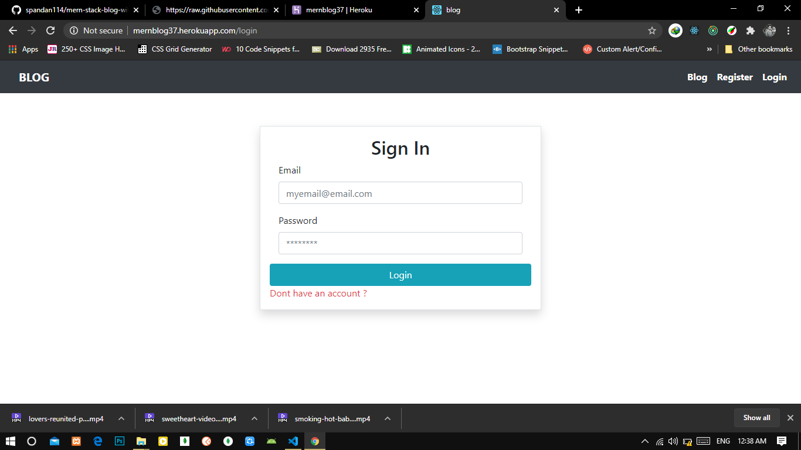
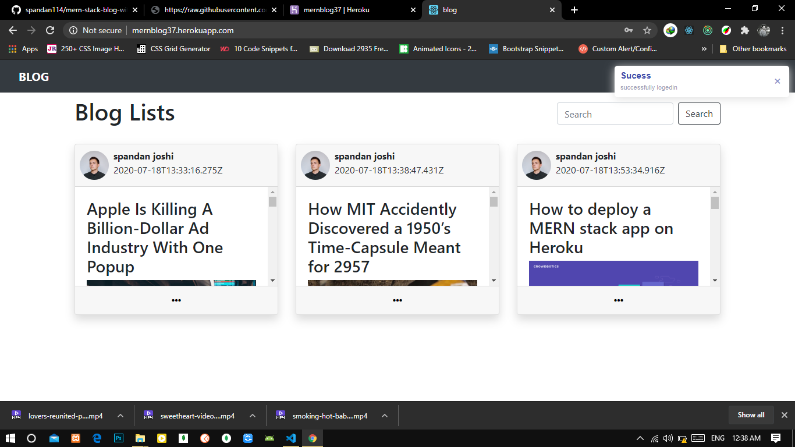
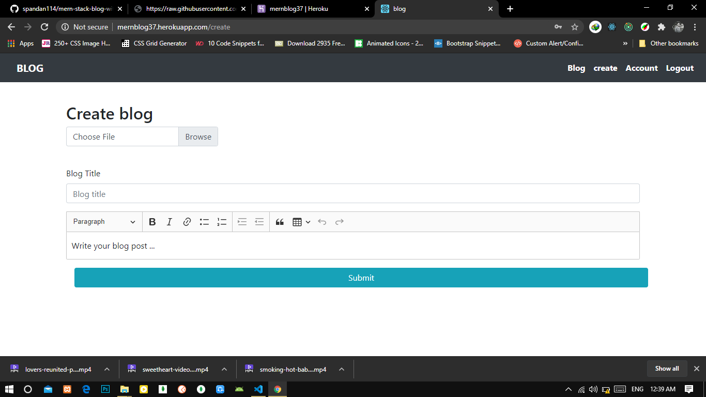
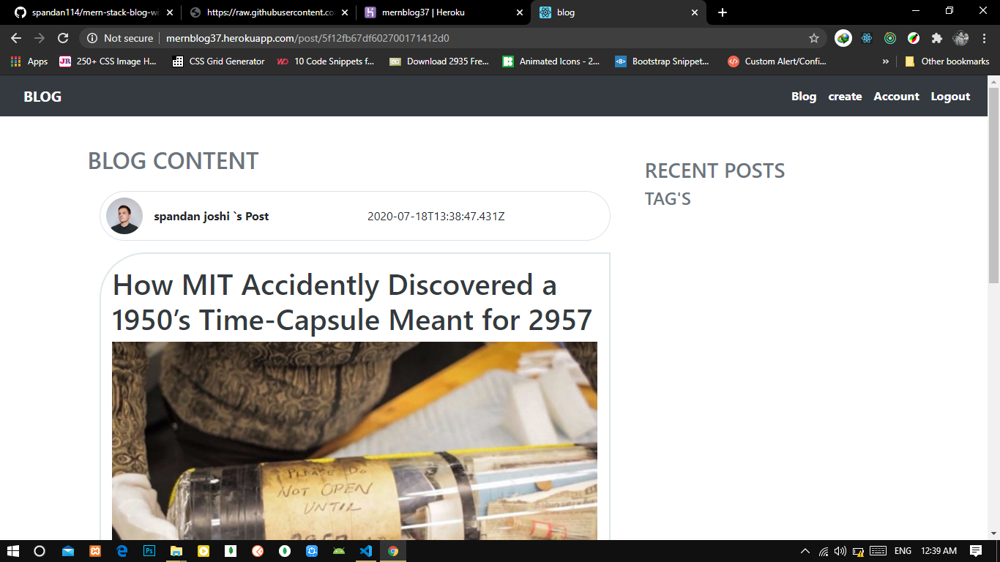

    

<h1 align="center">MERN-stack Blog App</h1>

[![Forks][forks-shield]][forks-url]
[![Issues][issues-shield]][issues-url]
[![MIT License][license-shield]][license-url]

### Packges used
+ ckEditor
+ butter-toast
+ bootstrap
+ axios
+ react-router-dom
+ redux
+ Etc ...

### How To Use
+ Clone this repo to your computer
+ "npm install" to install necessary modules 
+ "npm start" to run front-end
+ "npm start" to run back-end

### Project demo [MERN stack Blog ](https://mernblog37.herokuapp.com/)

### Blog Page

 

### Register Page

 

### login Page

 

### Success Message

 

### Create Blog Page

 

### Post Page

 

<h3>Contact Me:</h3>

    
<b>Portfolio:</b> https://spandan114.github.io/spandanjoshi-portfolio/ 

    
<b>Gmail:</b> spandanj685@gmail.com 

    
<b>GitHub:</b> https://github.com/spandan114

[forks-shield]: https://img.shields.io/github/forks/kaboobear/MEVN-Fitness-App?style=flat-square
[forks-url]: https://github.com/kaboobear/MEVN-Fitness-App/network/members
[issues-shield]: https://img.shields.io/github/issues/kaboobear/MEVN-Fitness-App.svg?style=flat-square
[issues-url]: https://github.com/kaboobear/MEVN-Fitness-App/issues
[license-shield]: https://img.shields.io/github/license/kaboobear/MEVN-Fitness-App.svg?style=flat-square
[license-url]: https://github.com/kaboobear/MEVN-Fitness-App/blob/master/LICENSE.txt